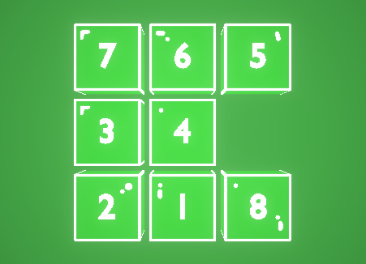
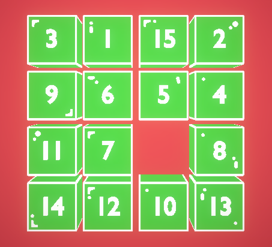

# Fifteen Slimes
**Fifteen Slimes is the casual mobile game. It is representing the traditional FifteenPuzzle game with unique and bright visual. Enjoy!**

This game has two modes: **3x3 and 4x4**

# A bit of the game theory
The **15 puzzle** (also called **Gem Puzzle, Boss Puzzle, Game of Fifteen, Mystic Square** and many others) is a sliding puzzle having 15 square tiles numbered 1–15 in a frame that is 4 tiles high and 4 tiles wide, leaving one unoccupied tile position. Tiles in the same row or column of the open position can be moved by sliding them horizontally or vertically, respectively. The goal of the puzzle is to place the tiles in numerical order.

Named for the number of tiles in the frame, the 15 puzzle may also be called a 16 puzzle, alluding to its total tile capacity. Similar names are used for different sized variants of the 15 puzzle, such as the **8 puzzle** that has 8 tiles in a 3×3 frame.

The n puzzle is a classical problem for modelling algorithms involving heuristics. Commonly used heuristics for this problem include counting the number of misplaced tiles and finding the sum of the taxicab distances between each block and its position in the goal configuration. Note that both are admissible, i.e. they never overestimate the number of moves left, which ensures optimality for certain search algorithms such as A*.
[This information was taken from wikipedia](https://en.wikipedia.org/wiki/15_puzzle)

# Report a bug
Before creating a new issue please make sure that it doesn't already exist by checking [open issues](https://github.com/Abbibbas/FifteenSlimes/issues?q=is%3Aopen+is%3Aissue) and [closed issues](https://github.com/Abbibbas/FifteenSlimes/issues?q=is%3Aissue+is%3Aclosed). If your issue is already there, don't create a new one, but leave a comment under already existing one.

Checklist for creating new issues:
- Keep titles short but descriptive.
- For bug reports leave as much information as possible about your device, android version, etc.
- For bug reports also write steps to reproduce the issue.

[Create new issue](https://github.com/Abbibbas/FifteenSlimes/issues/new).
